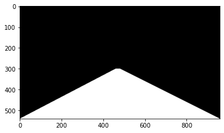

<h1 align="center">Project 1: Finding Lines on the Road</h1>

The goal of this first project was to **create a simple pipeline to detect road lines** in a frame taken from a roof-mounted camera.

Being the very first project, the pipeline is necessarily very simple. No machine learning is involved - just **computer vision** and a lot of *boring manual parameter tuning*. :-)

A short demo [videoclip](http://www.youtube.com/watch?feature=player_embedded&v=KlQ-8iD1EFM) (of a success case): can be found here:

<a href="http://www.youtube.com/watch?feature=player_embedded&v=KlQ-8iD1EFM" target="_blank"></a>


# 1. Read image
```python
img_path = "dataset_imgs/solidWhiteCurve.jpg"
image = cv2.cvtColor(cv2.imread(img_path, cv2.IMREAD_COLOR), cv2.COLOR_BGR2RGB)
```


# 2. Convert image to grayscale

To detect edeges we have to pass the image to black and white

```python
img_gray = cv2.cvtColor(image, cv2.COLOR_RGB2GRAY)
```


# 3. Reduce noise (optional)

### [Gaussian Blur](https://docs.opencv.org/2.4/modules/imgproc/doc/filtering.html#cv2.GaussianBlur)

```python
img_blur = cv2.GaussianBlur(img_gray, (5,5), 0)
```


### [Bilateral Filter](https://docs.opencv.org/2.4/modules/imgproc/doc/filtering.html#cv2.bilateralFilter) (NOT USED)

Alternative to GaussianBlur: bilateralFilter keeps the edges sharper.


# 4. Detect edges

### Sobel filter (NOT USED)

The Sobel filter is very commonly used in edge detection and in finding patterns in intensity in an image. Applying a Sobel filter to an image is a way of taking (an approximation) of the derivative of the image in the x or y direction, separately. The operators look as follows.

```python
filtered_image = cv2.filter2D(img_blur, -1, filters[i])
```


### Canny

Canny Edge Detection is a popular edge detection algorithm. It was developed by John F. Canny in 1986. It is a multi-stage algorithm and we will go through each stages.

1. Noise Reduction: Since edge detection is susceptible to noise in the image, first step is to remove the noise in the image with a 5x5 Gaussian filter.
2. Finding Intensity Gradient of the Image: Smoothened image is then filtered with a Sobel kernel in both horizontal and vertical direction.
3. Non-maximum suppression (thinning): Zero out all pixels that are not the maximum along the direction of the gradient (look at 1 pixel on each side)
4. Hysteresis Thresholding: This stage decides which are all edges are really edges and which are not. For this, we need two threshold values, minVal and maxVal.

```python
#img_edge = cv2.Canny(img_blur, threshold1=30, threshold2=100) Too wide
#img_edge = cv2.Canny(img_blur, threshold1=200, threshold2=240) Too tight
#img_edge = cv2.Canny(img_blur, threshold1=50, threshold2=150) Good
img_edge = cv2.Canny(img_blur, threshold1=50, threshold2=80) # Also good
```


# 5. Generate mask of Region of Interest

```python
height   = img_edge.shape[0]
width    = img_edge.shape[1]
polygon   = np.array([(0,height), (460,300), (480,300), (width,height)])
mask     = np.zeros_like(img_edge)
cv2.fillPoly(mask, [polygon], 255)
```




# 6. Bitwise "and" of EDGES + MASK

```python
road_edges = cv2.bitwise_and(img_edge, mask)
```


# 7. Finding lines: Hough transform


Hough space: A 2D plane where each point represents a line, the x-axis is the slope (m) and the y-axis, the intercept (n)

```python
lines = cv2.HoughLinesP(
         image         = road_edges,   # Input image
         rho           = 2,            # Distance resolution
         theta         = np.pi/180,    # Angle resolution
         threshold     = 45, # 100     # Min intersections
         lines         = np.array([]), # Output vector of lines
         minLineLength = 40,           # Minimum line length
         maxLineGap    = 100)  # 5     # Max gap between line points

line_image = np.zeros_like(image)
for line in lines:
    #x1, x2, y1, y2 = line.reshape(4)
    x1, y1, x2, y2 = line.reshape(4)
    cv2.line(line_image, (x1, y1), (x2, y2), color=(255,0,0), thickness=5)
```


# 8. Average lines

The goal is to have only 2 lines. Note if the slope is negative corresponds to the left side, and a positive slope corresponds to the right side.


# 9. Then display the lines with the image

```python
image_with_lines = cv2.addWeighted(line_image, 0.8, image, 1, 1)
```


# Reference

Here is a video that covers all the steps explained before

<a href="http://www.youtube.com/watch?feature=player_embedded&v=eLTLtUVuuy4" target="_blank">
	
</a>


