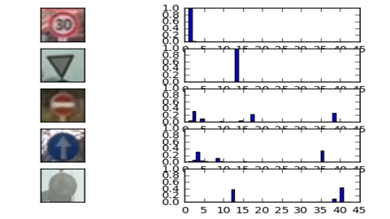
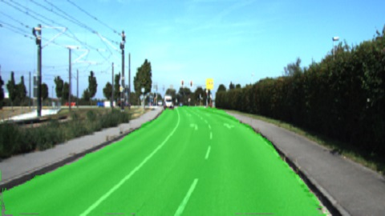
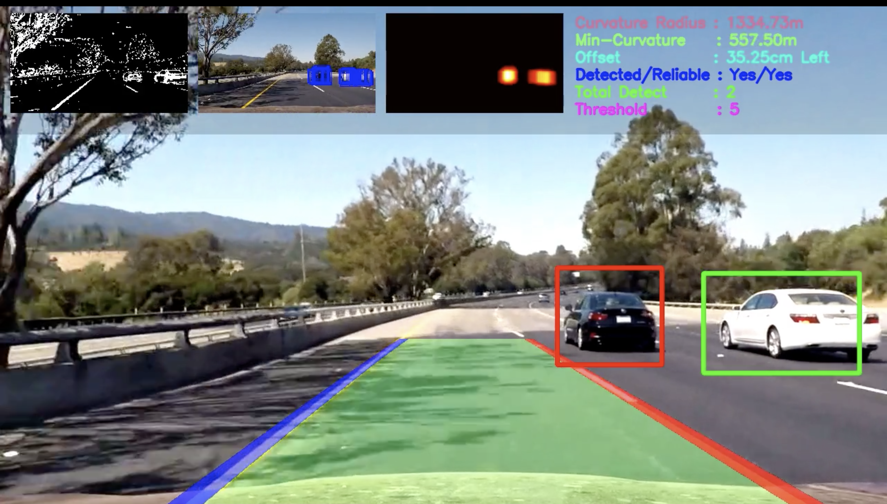

<h3 align="center">Build Week 3: Deep Learning + Computer Vision</h3>
<h1 align="center">Autonomous Driving</h1>

| Project                          | Desription                                                            | Image                                                  |
|----------------------------------|-----------------------------------------------------------------------|--------------------------------------------------------|
| [**Basic line detector**](Subproject%201%20-%20Basic%20line%20finder)      | OpenCV: Using Canny Edge Detection & Hough transform    |   |
| [**Curved line detector**](Subproject%202%20-%20Advanced%20line%20finder)  | OpenCV: Perspective transform and fit a 2nd order poly  |  |
| **Day/Night Classification**     | Detect (day/night) to turn the car lights (on/off).                   |                                                        |
| **Environment Classification**   | Detect (city/highway/offroad) to set a maximum speed limit.           |                                                        |
| **Weather Classification**       | Detect (sunny/rainy/snowy) to control traction of your wheels.        |                                                        |
| **Traffic signs Classification** | Detect traffict signs to get more information.                        |  |
| **Vehicle Detection**            | Put bounding boxes around cars, pedestrians, bicycles, traffic signs  |  |
| **Road segmentation**            | Detect the pixes of the free road                                     |  |
| **Depth detector**               | Detect if you have free space in front to control the accelerator.    |                                                        |
| **Put it all together**          | Make a single model with several "heads". This is how Tesla works.    |  |
| **Bonus: Simulation**            | Collect syntactic data from [CARLA](https://carla.org)                |                                                        |

# Datasets

| Dataset                | Task                        | Size      | Num. Images   | Link                                                                                    |
|------------------------|-----------------------------|-----------|---------------|-----------------------------------------------------------------------------------------|
| German Traffic Signs   | Classification (43 classes) | 299.79 MB | 50.000 images | [Kaggle dataset](https://www.kaggle.com/meowmeowmeowmeowmeow/gtsrb-german-traffic-sign) |
| Traffic Sign Detection | Detection (4 classes)       | 218.18 MB | 877 images    | [Kaggle dataset](https://www.kaggle.com/andrewmvd/road-sign-detection)                  |

# Udacity courses

- [Self-Driving Fundamentals: Featuring Apollo](https://www.udacity.com/course/self-driving-car-fundamentals-featuring-apollo--ud0419) FREE COURSE
- [Intro to Self-Driving Cars]https://www.udacity.com/course/intro-to-self-driving-cars--nd113) NANODEGREE 4 months
- [Become a Self-Driving Car Engineer](https://www.udacity.com/course/self-driving-car-engineer-nanodegree--nd013) NANODEGREE 6 months
- [Become a Sensor Fusion Engineer](https://www.udacity.com/course/sensor-fusion-engineer-nanodegree--nd313) NANODEGREE 4 months
  - [projects description](https://medium.com/udacity/udacity-self-driving-car-engineer-nanodegree-projects-12823ff1cd21)
  - [Repo with Source code of all the projects](https://github.com/ndrplz/self-driving-car)
  - [Other repo with Source code of all the projects](https://github.com/markmisener/udacity-self-driving-car-engineer)
  - [Other github user with Source code of all the projects](https://github.com/SiliconCar)

