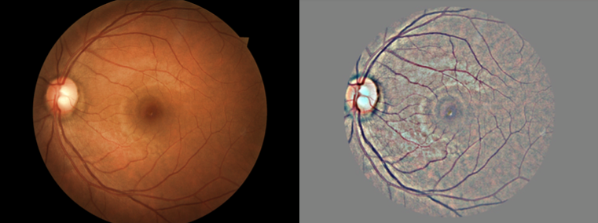
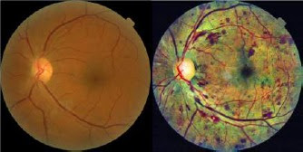

<h1 align="center">👀 Vision</h1>

> ### Index
>
> #### Part 1: Deep Learning
> 
> 1. [**Classification**](#classification)
> 3. [**Object detection**](#object-detection)
> 3. [**Segmentation**](#segmentation)
> 4. [**GANs**](#gans)
> 5. [**Loss functions**](#loss-functions)
> 6. [**CNN explainability**](#cnn-explainability)
> 7. [**Image preprocessing**](#image-preprocessing)
>
> #### Part 2: Traditional vision
> 
> 7. [**Optical Character Recognition (OCR)**](#ocr)
> 8. [**Image Matching (SIFT)**](#image-matching-sift)
> 9. [**Object Tracking**](#object-tracking)
>
> [**Resources**](#resources)

---
<h3 align="center">Part 1: Deep Learning</h3>

- [Convolutional Neural Network (CNN)](/posts/5-vision/cnn.md) For fixed size oredered data, like images
  - Variable input size: use **adaptative pooling**, final layers then:
    - Option 1: `AdaptiveAvgPool2d((1, 1))` -> `Linear(num_features, num_classes)` (less computation)
    - Option 2: `Conv2d(num_features, num_classes, 3, padding=1)` -> `AdaptiveAvgPool2d((1, 1))`
- To speed up jpeg image I/O from the disk one should not use PIL, skimage and even OpenCV but look for libjpeg-turbo or PyVips.

# Sota CNNs

- **Small nets**: Useful for mobile phones.
  - **SqueezeNet** (2016): v1.0: `58.108`, v1.1: `58.250`. [*paper*](https://arxiv.org/abs/1602.07360).
  - **Mobilenet v1** (2017): `69.600`The standard convolution is decomposed into two. Accuracy similar to Resnet-18. [*paper*](https://arxiv.org/abs/1704.04861)
  - **Shufflenet** (2017): The most efficient net `67.400`. [*paper*](https://arxiv.org/abs/1707.01083).
  - **NASNet-A-Mobile** (2017): `74.080`. [*paper*](https://arxiv.org/abs/1707.07012)
  - **Mobilenet v2** (2018): `71.800`. [*paper*](https://arxiv.org/abs/1801.04381)
  - **SqueezeNext** (2018): `62.640`. Hardware-Aware Neural network design. [*paper*](https://arxiv.org/abs/1803.10615).
- **Common nets**:
  - **Inception v3** (2015): `77.294` [*paper*](https://arxiv.org/abs/1512.00567), [*blog*](https://towardsdatascience.com/a-simple-guide-to-the-versions-of-the-inception-network-7fc52b863202)
  - **Resnet** (2015): Every 2 convolutions (3x3->3x3) **sum** the original input. [*paper*](https://arxiv.org/abs/1512.03385) Wide ResNet?
    - **Resnet-18**: `70.142`
    - **Resnet-34**: `73.554`
    - **Resnet-50**: `76.002`. **SE-ResNet50**: `77.636`. **SE-ResNeXt50 (32x4d)**: `79.076`
    - **Resnet-101**: `77.438`. **SE-ResNet101**: `78.396`. **SE-ResNeXt101 (32x4d)**: `80.236`
    - **Resnet-152**: `78.428`. **SE-ResNet152**: `78.658`
  - **Densenet** (2016): Every 2 convolutions (3x3->1x1) **concatenate** the original input. [*paper*](https://arxiv.org/abs/1608.06993)
    - **DenseNet-121**: `74.646`
    - **DenseNet-169**: `76.026`
    - **DenseNet-201**: `77.152`
    - **DenseNet-161**: `77.560`
  - **Xception** (2016): `78.888` [*paper*](https://arxiv.org/abs/1610.02357)
  - **ResNext** (2016): [*paper*](https://arxiv.org/abs/1611.05431)
    - **ResNeXt101 (32x4d)**:	`78.188`
    - **ResNeXt101 (64x4d)**:	`78.956`
  - **Dual Path Network (DPN)**: [*paper*](https://arxiv.org/abs/1707.01629)
    - **DualPathNet98**: `79.224`
    - **DualPathNet92_5k**: `79.400`
    - **DualPathNet131**: `79.432`
    - **DualPathNet107_5k**: `79.746`
  - **SENet** (2017): Squeeze and Excitation network. Net is allowed to adaptively adjust the weighting of each feature map in the convolution block. [*paper*](https://arxiv.org/abs/1709.01507)
    - **SE-ResNet50**: `77.636`
    - **SE-ResNet101**: `78.396`
    - **SE-ResNet152**: `78.658`
    - **SE-ResNeXt50 (32x4d)**: `79.076` **USE THIS ONE FOR A MEDIUM NET**
    - **SE-ResNeXt101 (32x4d)**: `80.236` **USE THIS ONE FOR A BIG NET**
- **Giants nets**: Useful for competitions.
  - **Inception v4**: `80.062`, **Inception-ResNet**: `80.170` [*paper*](https://arxiv.org/abs/1602.07261)
  - **PolyNet**: `81.002`
  - **SENet-154**: `81.304`
  - **NASNet-A-Large**: `82.566` Crated with AutoML. [*paper*](https://arxiv.org/abs/1707.07012)
  - **PNASNet-5-Large**: `82.736`
  - **AmoebaNet**: `83.000` [*paper*](https://arxiv.org/abs/1802.01548)

# CNN explainability
[*link 1*](https://github.com/utkuozbulak/pytorch-cnn-visualizations), [*link 2*](https://ramprs.github.io/2017/01/21/Grad-CAM-Making-Off-the-Shelf-Deep-Models-Transparent-through-Visual-Explanations.html)
- **Features**: Average features on the channel axis. This shows all classes detected. `[512, 11, 11]-->[11, 11]`.
- **CAM**: Class Activation Map. Final features multiplied by a single class weights and then averaged. `[512, 11, 11]*[512]-->[11, 11]`. [*paper*](https://arxiv.org/abs/1512.04150).
- **Grad-CAM**: Final features multiplied by class gradients and the averaged. [*paper*](https://arxiv.org/abs/1610.02391).
- **SmoothGrad** [*paper*](https://arxiv.org/abs/1706.03825).
- Extra: [Distill: feature visualization](https://distill.pub/2017/feature-visualization/)
- Extra: [Distill: building blocks](https://distill.pub/2018/building-blocks/)

> ### Libraries
> - [Captum](https://www.captum.ai) by Pytorch
> - [Lucid](https://github.com/tensorflow/lucid) by Tensorflow

# Object detection
Get bounding boxes.

> ### Check [**detectron 2**](https://ai.facebook.com/blog/-detectron2-a-pytorch-based-modular-object-detection-library-).

- Region-based methods
  - **R-CNN**:        [*paper*](https://arxiv.org/abs/1311.2524)
  - **Fast R-CNN**:   [*paper*](https://arxiv.org/abs/1504.08083)
  - **Faster R-CNN**: [*paper*](https://arxiv.org/abs/1506.01497)
  - **Mask R-CNN**:   [*paper*](https://arxiv.org/abs/1703.06870)
- Single-shot methods
  - **YOLOv1**: [*paper*](https://arxiv.org/abs/1506.02640)
  - **SSD**:    [*paper*](https://arxiv.org/abs/1512.02325)
  - **YOLOv2**: [*paper*](https://arxiv.org/abs/1612.08242)
  - **YOLOv3**: [*paper*](https://pjreddie.com/media/files/papers/YOLOv3.pdf)
  - **Feature Pyramid Networks (FPN)** (2016) [*paper*](https://arxiv.org/abs/1612.03144), [*slides*](http://presentations.cocodataset.org/COCO17-Stuff-FAIR.pdf)
  - **RetinaNet**: (2017) Focal Loss for Dense Object Detection [*paper*](https://arxiv.org/abs/1708.02002)
  - **Path Aggregation Network** (2018) [*paper*](https://arxiv.org/abs/1803.01534)

# Segmentation

> - https://www.jeremyjordan.me/semantic-segmentation
> - https://www.jeremyjordan.me/evaluating-image-segmentation-models

### Check [Res2Net](https://arxiv.org/abs/1904.01169)
### Check [catalyst segmentation tutorial (Ranger opt, albumentations, ...)](https://colab.research.google.com/github/catalyst-team/catalyst/blob/master/examples/notebooks/segmentation-tutorial.ipynb#scrollTo=Zm7JsNrczOQG)

Get pixel-level classes. Note that the model backbone can be a resnet, densenet, inception... Check [this repo](https://github.com/qubvel/segmentation_models)

- Semantic segmentation
  - **FCN** Fully Convolutional Networks (2014)
  - **SegNet** (2015)
  - **Unet**: Concatenate like a densenet [facebook](https://github.com/facebookresearch/fastMRI/tree/master/models/unet).
  - **LinkNet**: Adds like a resnet [*paper*](https://arxiv.org/abs/1707.03718)
  - **Pyramid Scene Parsing Net (PSPNet)** [*paper*](https://arxiv.org/abs/1612.01105)
  - **DeepLabv3** SotA. Increasing dilatation, increases field-of-view. [paper](https://arxiv.org/abs/1706.05587)
- Instance segmentation
  - **Feature Pyramid Networks (FPN)** (2016) [*paper*](https://arxiv.org/abs/1612.03144), [*slides*](http://presentations.cocodataset.org/COCO17-Stuff-FAIR.pdf)
  - **Path Aggregation Network** (2018) [*paper*](https://arxiv.org/abs/1803.01534)

# GANs

Useful for data augmentation, B&W colorization, super-resolution, artistic style...

### Check this [kaggle competition](https://www.kaggle.com/c/generative-dog-images)

- Generator: Pretrained Unet
- Training
  1. Train a bit the generator and save generated images. `unet_learner` with pixelMSE loss
  2. Train bit the discriminator with real vs generated images. `create_critic_learner`
  3. Ping-pong train both nets `GANLearner` with 2 losses pixelMSE and discriminator.
- Discriminative model with Spectral Normalization
- Loss with adaptive loss
- Metric accuracy is accuracy_thres_expand
- video
  - pix2pixHD
  - COVST: Naively add temporal consistency.
  - [Video-to-Video Synthesis](https://tcwang0509.github.io/vid2vid/)
  
#### GANs (order chronologically)

| Paper                                            | Name                        | Date     | Creator     |
|:------------------------------------------------:|-----------------------------|:--------:|:-----------:|
| [**GAN**     ](https://arxiv.org/abs/1406.2661)  | Generative Adversarial Net  | Jun 2014 | Goodfellow  |
| [**CGAN**    ](https://arxiv.org/abs/1411.1784)  | Conditional GAN             | Nov 2014 | Montreal U. |
| [**DCGAN**   ](https://arxiv.org/abs/1511.06434) | Deep Convolutional GAN      | Nov 2015 | Facebook    |
| [**GAN v2**  ](https://arxiv.org/abs/1606.03498) | Improved GAN                | Jun 2016 | Goodfellow  |
| [**InfoGAN** ](https://arxiv.org/abs/1606.03657) |                             | Jun 2016 | OpenAI      |
| [**CoGAN**   ](https://arxiv.org/abs/1606.07536) | Coupled GAN                 | Jun 2016 | Mitsubishi  |
| [**Pix2Pix** ](https://arxiv.org/abs/1611.07004) | Image to Image              | Nov 2016 | Berkeley    |
| [**StackGAN**](https://arxiv.org/abs/1612.03242) | Text to Image               | Dec 2016 | Baidu       |
| [**WGAN**    ](https://arxiv.org/abs/1701.07875) | Wasserstein GAN             | Jan 2017 | Facebook    |
| [**CycleGAN**](https://arxiv.org/abs/1703.10593) | Cycle GAN                   | Mar 2017 | Berkeley    |
| [**ProGAN**  ](https://arxiv.org/abs/1710.10196) | Progressive growing of GAN  | Oct 2017 | NVIDIA      |
| [**SAGAN**   ](https://arxiv.org/abs/1805.08318) | Self-Attention GAN          | May 2018 | Goodfellow  |
| [**BigGAN**  ](https://arxiv.org/abs/1809.11096) | Large Scale GAN Training    | Sep 2018 | Google      |
| [**StyleGAN**](https://arxiv.org/abs/1812.04948) | Style-based GAN             | Dec 2018 | NVIDIA      |

> 2014 (GAN) → 2015 (DCGAN) → 2016 (CoGAN) → 2017 (ProGAN) → 2018 (StyleGAN)
> 

#### GANS (order by type)
- Better error function
  - LSGAN https://arxiv.org/abs/1611.04076
  - RaGAN https://arxiv.org/abs/1807.00734
  - GAN v2 (Feature Matching) https://arxiv.org/abs/1606.03498
- **CGAN**: Only one particular class generation (instead of blurry multiclass).
- **InfoGAN**: Disentaged representation (Dec. 2016, OpenAI)
  - **CycleGAN**: Domain adaptation (Oct. 2017, Berkeley)
  - **SAGAN**: Self-Attention GAN (May. 2018, Google)
  - **Relativistic GAN**: Rethinking adversary (Jul. 2018, LD Isntitute)
  - **Progressive GAN**: One step at a time (Oct 2017, NVIDIA)
- **DCGAN**: Deep Convolutional GAN (Nov. 2016, Facebook)
  - **BigGAN**: SotA for image synthesis. Same GAN techiques, but larger. Increase model capacity & batch size.
  - **BEGAN**: Balancing Generator (May. 2017, Google)
  - **WGAN**: Wasserstein GAN. Learning distribution (Dec. 2017, Facebook)
- **VAEGAN**: Improving VAE by GANs (Feb. 2016, TU Denmark)
- **SeqGAN**: Sequence learning with GANs (May 2017, Shangai Univ.)

# Loss functions and metrics

- Loss
  - **Segmentation**: Usually Loss = **IoU** + **Dice** + 0.8***BCE**
    - **Pixel-wise cross entropy**: each pixel individually, comparing the class predictions (depth-wise pixel vector)
    - **IoU** (F0): `(Pred ∩ GT)/(Pred ∪ GT)` = `TP / TP + FP * FN`
    - **Dice** (F1): `2 * (Pred ∩ GT)/(Pred + GT)` = `2·TP / 2·TP + FP * FN`
      - Range from `0` (worst) to `1` (best)
      - In order to formulate a loss function which can be minimized, we'll simply use `1 − Dice`
  - **Generation**
     - **Pixel MSE**: Flat the 2D images and compare them with regular MSE.
     - **Discriminator/Critic** The loss function is a binary classification pretrained resnet (real/fake).
     - **Feature losses** or perpetual losses.

# Image preprocessing

### Normalization
Substact RGB mean pixels and divide by RGB std: `x = x-x.mean() / x.std()`

### PCA and Whitening

### Subtract local mean

### CLAHE: Contrast Limited Adaptive Histogram Equalization

### Dicom
> - [Some DICOM gotchas to be aware of (fastai)](https://www.kaggle.com/jhoward/some-dicom-gotchas-to-be-aware-of-fastai)
> - [DON'T see like a radiologist! (fastai)](https://www.kaggle.com/jhoward/don-t-see-like-a-radiologist-fastai)

---
<h3 align="center">Part 2:  Traditional vision</h3>

# Image Matching (SIFT)
[Check this article](https://www.analyticsvidhya.com/blog/2019/10/detailed-guide-powerful-sift-technique-image-matching-python)

# Resources

- Others
  - Inceptionism
  - Capsule net
- [pyimagesearch: Start here](https://www.pyimagesearch.com/start-here)
- GANs
  - [10 types of GANs](https://amp.reddit.com/r/MachineLearning/comments/8z97mx/r_math_insights_from_10_gan_papers_infogans)
  - [floydhub: GANs, the Story So Far](https://blog.floydhub.com/gans-story-so-far)
  - [infoGAN](http://www.depthfirstlearning.com/2018/InfoGAN)
- [Pretrained models in pytorch](https://github.com/Cadene/pretrained-models.pytorch)
- [Ranking](https://openreview.net/pdf?id=Hyzq4ZKa97),
- [comparison paper](https://arxiv.org/pdf/1810.00736.pdf)
- [Little tricks paper](https://arxiv.org/abs/1812.01187)
- [GPipe](https://arxiv.org/pdf/1811.06965v4.pdf)
