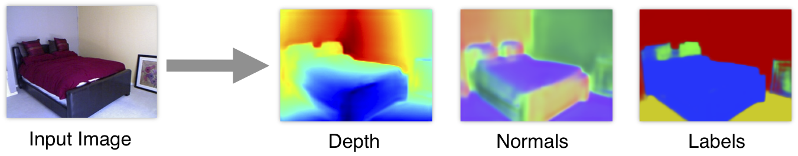

<h1 align="center">👀 Vision</h1>

# Index

> #### Part 1: Traditional CV
> -  **Finding Descriptors** (SIFT, SURF, FAST, BRIEF, ORB,BRISK)
> -  **Image Stitching** (Brute-Force, FLANN, RANSAC)
>
>
> #### Part 2: Deep Learning
> - 🧱 Part 1: Basics
>   - [**Classification**](#classification)
>   - [**Object detection**](#object-detection)
>   - [**Segmentation**](#segmentation)
> - 🎥 Part 2: Video Understing 
>   - [**Activity recognition**](#activity-recognition)
>   - [**Object Tracking**](#object-tracking)
>   - [**Product placement**](#product-placement)
> - 🧭 Part 3: 3D Understing
>   - [**SLAM**](#slam)
>   - [**3D reconstruction**](#3d)
>   - CapsuleNets
> - 🖼 Part 4: Generation
>   - Autoencoder
>   - [**GANs**](#gans)
> - Part 5: Other
>   - Super-resolution
>   - Colourisation
>   - Style Transfer
>   - [**Optical Character Recognition (OCR)**](#ocr)
> - Part 6: technical
>   - 📉 [**Loss functions**](#-loss-functions)
>   - 📏 [**Metrics**](#metrics)
>   - 🔍 [**CNN explainability**](#cnn-explainability)
>   - 🔨 [**Image preprocessing**](#image-preprocessing)
>
> [**Resources**](#resources)

---
<h2 align="center">Image theory</h2>

<h1 align="center">Part 1: Traditional vision</h1>

# Feature detection and Description

|                  |  SIFT                    | SURF                | FAST              | BRIEF            | ORB              | BRISK            |
|:----------------:|:------------------------:|:-------------------:|:-----------------:|:----------------:|:----------------:|:----------------:|
| Year             | 1999                     | 2006                | 2006              | 2010             | 2011             | 2011             |
| Feature detector | Difference of Gaussian   | Fast Hessian        | Binary comparison | -                | FAST             | FAST or AGAST    |
| Spectra          | Local gradient magnitude | Integral box filter |       -           | Local binary     | Local binary     | Local binary     |
| Orientation      | Yes                      | Yes                 |       -           | No               | Yes              | Yes              |
| Feature shape    | Square                   | HAAR rectangles     |       -           | Square           | Square           | Square               
| Feature pattern  | Square                   | Dense               |       -           | Random point-par pixel compares | Trained point-par pixel compares| Trained point-par pixel compares |
| Distance func.   | Euclidean                | Euclidean           |       -           | Hamming          | Hamming          | Hamming          |
| Pros             | Accurate                 | Accurate            | FAST (real time)  | FAST (real time) | FAST (real time) | FAST (real time) |
| Cons             | Slow, patented           | Slow, patented      | Large number of points | Scale and roation invariant | Less scale invariant | Less scale invariant |

### References
- [3.1 Methods comparison](https://www.coursera.org/lecture/ar-technologies-video-streaming/3-1-ar-feature-detection-description-method-comparison-1NT5I)
  - [3.2 SIFT](https://www.coursera.org/lecture/ar-technologies-video-streaming/3-2-sift-WtSmG)
  - [3.3 SURF](https://www.coursera.org/lecture/ar-technologies-video-streaming/3-3-surf-85SBI)
  - [3.4 FAST](https://www.coursera.org/lecture/ar-technologies-video-streaming/3-4-fast-MMMBw)
  - [3.5 BRIEF](https://www.coursera.org/lecture/ar-technologies-video-streaming/3-5-brief-CH8ez)
  - [3.6 ORB](https://www.coursera.org/lecture/ar-technologies-video-streaming/3-6-orb-iqMvt)
  - [3.7 BRISK](https://www.coursera.org/lecture/ar-technologies-video-streaming/3-7-brisk-T6CnA)
- [Tutorials in openCV](https://docs.opencv.org/3.4/db/d27/tutorial_py_table_of_contents_feature2d.html)
- [A Detailed Guide to SIFT for Image Matching (with Python code)](https://www.analyticsvidhya.com/blog/2019/10/detailed-guide-powerful-sift-technique-image-matching-python)

# Image Stitching

Steps:

1. Detecting keypoints (DoG, Harris, etc.) and extracting local invariant descriptors (SIFT, SURF, etc.) from two input images
2. Matching the descriptors between the images (overlapping area)
3. Using the RANSAC algorithm to estimate a homography matrix using our matched feature vectors
4. Applying a warping transformation using the homography matrix obtained from Step #3
   - Apply perspective transformation on one image using the other image as a reference frame

### References
- https://www.pyimagesearch.com/2018/12/17/image-stitching-with-opencv-and-python/
- http://datahacker.rs/005-how-to-create-a-panorama-image-using-opencv-with-python/

# Motion and optical Flow

http://datahacker.rs/013-optical-flow-using-horn-and-schunck-method/

---

<h1 align="center">Part 2: Deep Learning</h1>

- [Convolutional Neural Network (CNN)](/posts/5-vision/cnn.md) For fixed size oredered data, like images
  - Variable input size: use **adaptative pooling**, final layers then:
    - Option 1: `AdaptiveAvgPool2d((1, 1))` -> `Linear(num_features, num_classes)` (less computation)
    - Option 2: `Conv2d(num_features, num_classes, 3, padding=1)` -> `AdaptiveAvgPool2d((1, 1))`
- To speed up jpeg image I/O from the disk one should not use PIL, skimage and even OpenCV but look for libjpeg-turbo or PyVips.

<h2 align="center">Data Augmentation</h2>

### Separable convolution

# Sota CNNs

|                        | Description                               | Paper                                        |
|:-----------------------|:------------------------------------------|----------------------------------------------|
| **Inception v3**       |                                           | [Dec 2015](https://arxiv.org/abs/1512.00567) |
| **Resnet**             |                                           | [Dec 2015](https://arxiv.org/abs/1512.03385) |
| **SqueezeNet**         |                                           | [Feb 2016](https://arxiv.org/abs/1602.07360) |
| **Densenet**           | Concatenate previous layers               | [Aug 2016](https://arxiv.org/abs/1608.06993) |
| **Xception**           | Depthwise Separable Convolutions          | [Oct 2016](https://arxiv.org/abs/1610.02357) |
| **ResNext**            |                                           | [Nov 2016](https://arxiv.org/abs/1611.05431) |
| **DPN**                | Dual Path Network                         | [Jul 2017](https://arxiv.org/abs/1707.01629) |
| **SENet**              | Squeeze and Excitation (channels weights) | [Sep 2017](https://arxiv.org/abs/1709.01507) |
| **EfficientNet**       | Rethinking Model Scaling                  | [May 2019](https://arxiv.org/abs/1905.11946) |
| **Noisy Student**      | Self-training                             | [Nov 2019](https://arxiv.org/abs/1911.04252) |

- **Small nets**: Useful for mobile phones.
  - **SqueezeNet** (2016): v1.0: `58.108`, v1.1: `58.250`. [*paper*](https://arxiv.org/abs/1602.07360).
  - **Mobilenet v1** (2017): `69.600`The standard convolution is decomposed into two. Accuracy similar to Resnet-18. [*paper*](https://arxiv.org/abs/1704.04861)
  - **Shufflenet** (2017): The most efficient net `67.400`. [*paper*](https://arxiv.org/abs/1707.01083).
  - **NASNet-A-Mobile** (2017): `74.080`. [*paper*](https://arxiv.org/abs/1707.07012)
  - **Mobilenet v2** (2018): `71.800`. [*paper*](https://arxiv.org/abs/1801.04381)
  - **SqueezeNext** (2018): `62.640`. Hardware-Aware Neural network design. [*paper*](https://arxiv.org/abs/1803.10615).
- **Common nets**:
  - **Inception v3** (2015): `77.294` [*paper*](https://arxiv.org/abs/1512.00567), [*blog*](https://towardsdatascience.com/a-simple-guide-to-the-versions-of-the-inception-network-7fc52b863202)
  - **Resnet** (2015): Every 2 convolutions (3x3->3x3) **sum** the original input. [*paper*](https://arxiv.org/abs/1512.03385) Wide ResNet?
    - **Resnet-18**: `70.142`
    - **Resnet-34**: `73.554`
    - **Resnet-50**: `76.002`. **SE-ResNet50**: `77.636`. **SE-ResNeXt50 (32x4d)**: `79.076`
    - **Resnet-101**: `77.438`. **SE-ResNet101**: `78.396`. **SE-ResNeXt101 (32x4d)**: `80.236`
    - **Resnet-152**: `78.428`. **SE-ResNet152**: `78.658`
  - **Densenet** (2016): Every 2 convolutions (3x3->1x1) **concatenate** the original input. [*paper*](https://arxiv.org/abs/1608.06993)
    - **DenseNet-121**: `74.646`
    - **DenseNet-169**: `76.026`
    - **DenseNet-201**: `77.152`
    - **DenseNet-161**: `77.560`
  - **Xception** (2016): `78.888` [*paper*](https://arxiv.org/abs/1610.02357)
  - **ResNext** (2016): [*paper*](https://arxiv.org/abs/1611.05431)
    - **ResNeXt101 (32x4d)**:	`78.188`
    - **ResNeXt101 (64x4d)**:	`78.956`
  - **Dual Path Network (DPN)**: [*paper*](https://arxiv.org/abs/1707.01629)
    - **DualPathNet98**: `79.224`
    - **DualPathNet92_5k**: `79.400`
    - **DualPathNet131**: `79.432`
    - **DualPathNet107_5k**: `79.746`
  - **SENet** (2017): Squeeze and Excitation network. Net is allowed to adaptively adjust the weighting of each feature map in the convolution block. [*paper*](https://arxiv.org/abs/1709.01507)
    - **SE-ResNet50**: `77.636`
    - **SE-ResNet101**: `78.396`
    - **SE-ResNet152**: `78.658`
    - **SE-ResNeXt50 (32x4d)**: `79.076` **USE THIS ONE FOR A MEDIUM NET**
    - **SE-ResNeXt101 (32x4d)**: `80.236` **USE THIS ONE FOR A BIG NET**
- **Giants nets**: Useful for competitions.
  - **Inception v4**: `80.062`, **Inception-ResNet**: `80.170` [*paper*](https://arxiv.org/abs/1602.07261)
  - **PolyNet**: `81.002`
  - **SENet-154**: `81.304`
  - **NASNet-A-Large**: `82.566` Crated with AutoML. [*paper*](https://arxiv.org/abs/1707.07012)
  - **PNASNet-5-Large**: `82.736`
  - **AmoebaNet**: `83.000` [*paper*](https://arxiv.org/abs/1802.01548)

# CNN explainability
[*link 1*](https://github.com/utkuozbulak/pytorch-cnn-visualizations), [*link 2*](https://ramprs.github.io/2017/01/21/Grad-CAM-Making-Off-the-Shelf-Deep-Models-Transparent-through-Visual-Explanations.html)
- **Features**: Average features on the channel axis. This shows all classes detected. `[512, 11, 11]-->[11, 11]`.
- **CAM**: Class Activation Map. Final features multiplied by a single class weights and then averaged. `[512, 11, 11]*[512]-->[11, 11]`. [*paper*](https://arxiv.org/abs/1512.04150).
- **Grad-CAM**: Final features multiplied by class gradients and the averaged. [*paper*](https://arxiv.org/abs/1610.02391).
- **SmoothGrad** [*paper*](https://arxiv.org/abs/1706.03825).
- Extra: [Distill: feature visualization](https://distill.pub/2017/feature-visualization/)
- Extra: [Distill: building blocks](https://distill.pub/2018/building-blocks/)

> ### Libraries
> - [Captum](https://www.captum.ai) by Pytorch
> - [Lucid](https://github.com/tensorflow/lucid) by Tensorflow

# Object detection
Get bounding boxes.

> ### Check [**detectron 2**](https://ai.facebook.com/blog/-detectron2-a-pytorch-based-modular-object-detection-library-).
> - [Digging into Detectron 2 (part 4)](https://medium.com/@hirotoschwert/digging-into-detectron-2-part-4-3d1436f91266)
> - [*FPN slides*](http://presentations.cocodataset.org/COCO17-Stuff-FAIR.pdf)

| Name                                                 | Description                | Date     | Type         |
|:----------------------------------------------------:|----------------------------|:--------:|:------------:|
| [**R-CNN**       ](https://arxiv.org/abs/1311.2524)  |                            | Nov 2013 | Region-based |
| [**Fast R-CNN**  ](https://arxiv.org/abs/1504.08083) |                            | Apr 2015 | Region-based |
| [**Faster R-CNN**](https://arxiv.org/abs/1506.01497) |                            | Jun 2015 | Region-based |
| [**YOLO v1**     ](https://arxiv.org/abs/1506.02640) | You Only Look Once         | Jun 2015 | Single-shot  |
| [**SSD**         ](https://arxiv.org/abs/1512.02325) | Single Shot Detector       | Dec 2015 | Single-shot  |
| [**FPN**         ](https://arxiv.org/abs/1612.03144) | Feature Pyramid Network    | Dec 2016 | Single-shot  |
| [**YOLO v2**     ](https://arxiv.org/abs/1612.08242) | Better, Faster, Stronger   | Dec 2016 | Single-shot  |
| [**Mask R-CNN**  ](https://arxiv.org/abs/1703.06870) |                            | Mar 2017 | Region-based |
| [**RetinaNet**   ](https://arxiv.org/abs/1708.02002) | Focal Loss                 | Aug 2017 | Single-shot  |
| [**PANet**       ](https://arxiv.org/abs/1803.01534) | Path Aggregation Network   | Mar 2018 | Single-shot  |
| [**YOLO v3**     ](https://arxiv.org/abs/1804.02767) | An Incremental Improvement | Apr 2018 | Single-shot  |
| [**EfficientDet**](https://arxiv.org/abs/1911.09070) | Based on EfficientNet      | Nov 2019 | Single-shot  |
| [**YOLO v4**     ](https://arxiv.org/abs/2004.10934) | Optimal Speed and Accuracy | Apr 2020 | Single-shot  |

# Segmentation

> - https://www.jeremyjordan.me/semantic-segmentation
> - https://www.jeremyjordan.me/evaluating-image-segmentation-models
> - Check [Res2Net](https://arxiv.org/abs/1904.01169)
> - Check [catalyst segmentation tutorial (Ranger opt, albumentations, ...)](https://colab.research.google.com/github/catalyst-team/catalyst/blob/master/examples/notebooks/segmentation-tutorial.ipynb#scrollTo=Zm7JsNrczOQG)
> - [this repo](https://github.com/qubvel/segmentation_models)

Get pixel-level classes. Note that the model backbone can be a resnet, densenet, inception...

| Name                                              | Description                           | Date     | Instances |
|:-------------------------------------------------:|---------------------------------------|:--------:|:---------:|
| [**FCN**      ]()                                 | Fully Convolutional Network           | 2014     |           |
| [**SegNet**   ](https://arxiv.org/abs/1511.00561) | Encoder-decorder                      | 2015     |           |
| [**Unet**     ](https://arxiv.org/abs/1505.04597) | Concatenate like a densenet           | 2015     |           |
| [**ENet**     ](https://arxiv.org/abs/1606.02147) | Real-time **video** segmentation      | 2016     |           |
| [**PSPNet**   ](https://arxiv.org/abs/1612.01105) | Pyramid Scene Parsing Net             | 2016     |           |
| [**FPN**      ](https://arxiv.org/abs/1612.03144) | Feature Pyramid Networks              | 2016     | Yes       |
| [**DeepLabv3**](https://arxiv.org/abs/1706.05587) | Increasing dilatation & field-of-view | 2017     |           |
| [**LinkNet**  ](https://arxiv.org/abs/1707.03718) | Adds like a resnet                    | 2017     |           |
| [**PANet**    ](https://arxiv.org/abs/1803.01534) | Path Aggregation Network              | 2018     | Yes       |
| [**Panop FPN**](https://arxiv.org/abs/1901.02446) | Panoptic Feature Pyramid Networks     | 2019     | ?         |
| [**PointRend**](https://arxiv.org/abs/1912.08193) | Image Segmentation as Rendering       | 2019     | ?         |

> **Feature Pyramid Networks (FPN): [slides](http://presentations.cocodataset.org/COCO17-Stuff-FAIR.pdf)**

### Depth segmentation
Learning the Depths of Moving People by Watching Frozen People (mannequin challenge) [paper](https://arxiv.org/abs/1904.11111)

### Surface normal segmentation

- [paper](https://arxiv.org/abs/1411.4958) (2014)

# GANs

> #### Reference
> - Check this [kaggle competition](https://www.kaggle.com/c/generative-dog-images)
> - [Fast.ai decrappify & DeOldify](https://www.fast.ai/2019/05/03/decrappify)

### Applications:
- Image to image problems
  - Super Resolution
  - Black and white colorization
    - [Colorful Image Colorization](https://arxiv.org/abs/1603.08511) 2016
    - [DeOldify](https://github.com/jantic/DeOldify) 2018, SotA
  - Decrappification
  - Artistic style
  - Data augmentation:
-  New images
   - From latent vector
   - From noise image
  
### Training
0. Generate **labeled dataset**
   - Edit ground truth images to become the input images.
   - This step depend of the problem: input data could be crappified, black & white, noise, vector ...
1. Train the **GENERATOR** (most of the time)
   - Model: **UNET** with pretrained **ResNet** backbone + **self attention** + spectral normalization
   - Loss: Mean squared pixel error or L1 loss
   - Better Loss: Perceptual Loss (aka Feature Loss)
2. Save generated images.
3. Train the **DISCRIMINATOR** (aka Critic) with real vs generated images.
   -  Model: Pretrained **binary classifier** + spectral normalization
4. Train **BOTH** nets (ping-pong) with 2 losses (original and discriminator).
   - With a **NoGAN** approach, this step is very quick (a 5% of the total training time, more o less)
   - With a traditional progressively-sized GAN approach, this step is very slow.
   - If train so much this step, you start seeing artifacts and glitches introduced in renderings.

### Tricks
- **Self-Attention** GAN ([SAGAN](https://arxiv.org/abs/1805.08318)): For spatial coherence between regions of the generated image
- Spectral normalization
- Video
  - pix2pixHD
  - COVST: Naively add temporal consistency.
  - [Video-to-Video Synthesis](https://tcwang0509.github.io/vid2vid/)
  
#### GANs (order chronologically)

| Paper                                            | Name                        | Date     | Creator     |
|:------------------------------------------------:|-----------------------------|:--------:|:-----------:|
| [**GAN**     ](https://arxiv.org/abs/1406.2661)  | Generative Adversarial Net  | Jun 2014 | Goodfellow  |
| [**CGAN**    ](https://arxiv.org/abs/1411.1784)  | Conditional GAN             | Nov 2014 | Montreal U. |
| [**DCGAN**   ](https://arxiv.org/abs/1511.06434) | Deep Convolutional GAN      | Nov 2015 | Facebook    |
| [**GAN v2**  ](https://arxiv.org/abs/1606.03498) | Improved GAN                | Jun 2016 | Goodfellow  |
| [**InfoGAN** ](https://arxiv.org/abs/1606.03657) |                             | Jun 2016 | OpenAI      |
| [**CoGAN**   ](https://arxiv.org/abs/1606.07536) | Coupled GAN                 | Jun 2016 | Mitsubishi  |
| [**Pix2Pix** ](https://arxiv.org/abs/1611.07004) | Image to Image              | Nov 2016 | Berkeley    |
| [**StackGAN**](https://arxiv.org/abs/1612.03242) | Text to Image               | Dec 2016 | Baidu       |
| [**WGAN**    ](https://arxiv.org/abs/1701.07875) | Wasserstein GAN             | Jan 2017 | Facebook    |
| [**CycleGAN**](https://arxiv.org/abs/1703.10593) | Cycle GAN                   | Mar 2017 | Berkeley    |
| [**ProGAN**  ](https://arxiv.org/abs/1710.10196) | Progressive growing of GAN  | Oct 2017 | NVIDIA      |
| [**SAGAN**   ](https://arxiv.org/abs/1805.08318) | Self-Attention GAN          | May 2018 | Goodfellow  |
| [**BigGAN**  ](https://arxiv.org/abs/1809.11096) | Large Scale GAN Training    | Sep 2018 | Google      |
| [**StyleGAN**](https://arxiv.org/abs/1812.04948) | Style-based GAN             | Dec 2018 | NVIDIA      |

> 2014 (GAN) → 2015 (DCGAN) → 2016 (CoGAN) → 2017 (ProGAN) → 2018 (StyleGAN)
> 

#### GANS (order by type)
- Better error function
  - LSGAN https://arxiv.org/abs/1611.04076
  - RaGAN https://arxiv.org/abs/1807.00734
  - GAN v2 (Feature Matching) https://arxiv.org/abs/1606.03498
- **CGAN**: Only one particular class generation (instead of blurry multiclass).
- **InfoGAN**: Disentaged representation (Dec. 2016, OpenAI)
  - **CycleGAN**: Domain adaptation (Oct. 2017, Berkeley)
  - **SAGAN**: Self-Attention GAN (May. 2018, Google)
  - **Relativistic GAN**: Rethinking adversary (Jul. 2018, LD Isntitute)
  - **Progressive GAN**: One step at a time (Oct 2017, NVIDIA)
- **DCGAN**: Deep Convolutional GAN (Nov. 2016, Facebook)
  - **BigGAN**: SotA for image synthesis. Same GAN techiques, but larger. Increase model capacity & batch size.
  - **BEGAN**: Balancing Generator (May. 2017, Google)
  - **WGAN**: Wasserstein GAN. Learning distribution (Dec. 2017, Facebook)
- **VAEGAN**: Improving VAE by GANs (Feb. 2016, TU Denmark)
- **SeqGAN**: Sequence learning with GANs (May 2017, Shangai Univ.)

# Product placement

#### Technology
- **Background-foreground segmentation** so images simply slide behind objects in the front zone.
- **Optical flow analysis** helps determine the overall movement of virtual ads.
- **Planar tracking** helps smooth positioning.
- **Image color adjustment** is optimized according to the environment.

#### Papers
- CASE dataset[paper](https://arxiv.org/abs/1903.08943)
- ALOS dataset[paper](https://arxiv.org/abs/1904.07776)
- Identifying Candidate Spaces with CASE ds [paper](https://arxiv.org/abs/1910.03227)

#### Companies
- [Mirriad](https://www.mirriad.com)
- [Swappear](http://www.swappear.com)

# 📉 Loss functions

- **Segmentation**: Usually Loss = **IoU** + **Dice** + 0.8***BCE**
  - **Pixel-wise cross entropy**: each pixel individually, comparing the class predictions (depth-wise pixel vector)
  - **IoU** (F0): `(Pred ∩ GT)/(Pred ∪ GT)` = `TP / TP + FP * FN`
  - **Dice** (F1): `2 * (Pred ∩ GT)/(Pred + GT)` = `2·TP / 2·TP + FP * FN`
    - Range from `0` (worst) to `1` (best)
    - In order to formulate a loss function which can be minimized, we'll simply use `1 − Dice`
- **Generation**
   - **Pixel MSE**: Flat the 2D images and compare them with regular MSE.
   - **Discriminator/Critic** The loss function is a binary classification pretrained resnet (real/fake).
   - **Feature losses** or perpetual losses.

# Image preprocessing
    
### Normalization
1. **Mean subtraction**: Center the data to zero. `x = x - x.mean()` fights vanishing and exploding gradients
2. **Standardize**: Put the data on the same scale. `x = x / x.std()` improves convergence speed and accuracy

### PCA and Whitening
1. **Mean subtraction**: Center the data in zero. `x = x - x.mean()`
2. **Decorrelation** or **PCA**: Rotate the data until there is no correlation anymore.
3. **Whitening**: Put the data on the same scale. `whitened = decorrelated / np.sqrt(eigVals + 1e-5)`

> #### ZCA Whitening with Zero component analysis (ZCA) is a very similar process.

### Subtract Local Mean

### CLAHE: Contrast Limited Adaptive Histogram Equalization

### Dicom
> - [Some DICOM gotchas to be aware of (fastai)](https://www.kaggle.com/jhoward/some-dicom-gotchas-to-be-aware-of-fastai)
> - [DON'T see like a radiologist! (fastai)](https://www.kaggle.com/jhoward/don-t-see-like-a-radiologist-fastai)

---

# Resources

> - [Google tutorial image classification](https://codelabs.developers.google.com/codelabs/keras-flowers-tpu/)
> - Paper:
>   - [Bag of Tricks for Image Classification with CNNs](https://arxiv.org/abs/1812.01187) (2018)
>   - [Compounding the Performance Improvements of Assembled Techniques in a CNN](https://arxiv.org/abs/2001.06268) (2020)
> - ML training video: [Bag of Tricks](https://youtu.be/JDwAlbr1IB4) (2020)
> - [awesome-data-augmentation](https://github.com/CrazyVertigo/awesome-data-augmentation)
> - http://szeliski.org/Book
> 
- A year in computer vision
  - [Part 1](https://towardsdatascience.com/a-year-in-computer-vision-part-1-of-4-eaeb040b6f46)
  - [Part 2](https://towardsdatascience.com/a-year-in-computer-vision-part-2-of-4-893e18e12be0)
  - [Part 3](https://towardsdatascience.com/a-year-in-computer-vision-part-3-of-4-861216d71607)
  - [Part 4](https://towardsdatascience.com/a-year-in-computer-vision-part-4-of-4-515c61d41a00)
- Others
  - Inceptionism
  - Capsule net
- [pyimagesearch: Start here](https://www.pyimagesearch.com/start-here)
- GANs
  - [10 types of GANs](https://amp.reddit.com/r/MachineLearning/comments/8z97mx/r_math_insights_from_10_gan_papers_infogans)
  - [floydhub: GANs, the Story So Far](https://blog.floydhub.com/gans-story-so-far)
  - [infoGAN](http://www.depthfirstlearning.com/2018/InfoGAN)
- [Pretrained models in pytorch](https://github.com/Cadene/pretrained-models.pytorch)
- [Ranking](https://openreview.net/pdf?id=Hyzq4ZKa97),
- [comparison paper](https://arxiv.org/pdf/1810.00736.pdf)
- [Little tricks paper](https://arxiv.org/abs/1812.01187)
- [GPipe](https://arxiv.org/pdf/1811.06965v4.pdf)
